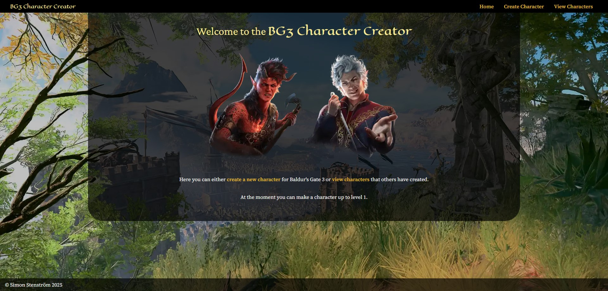
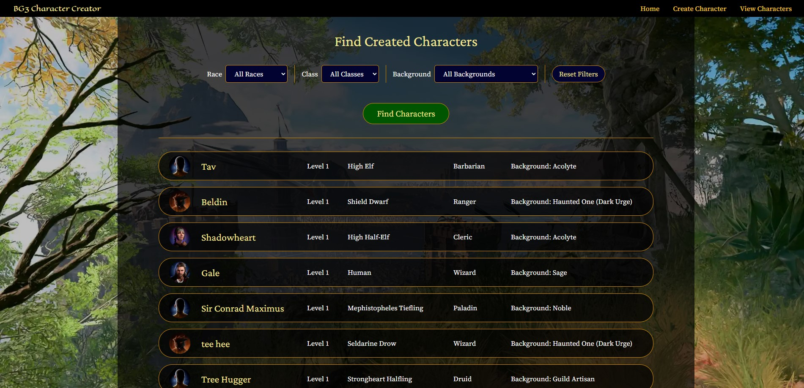
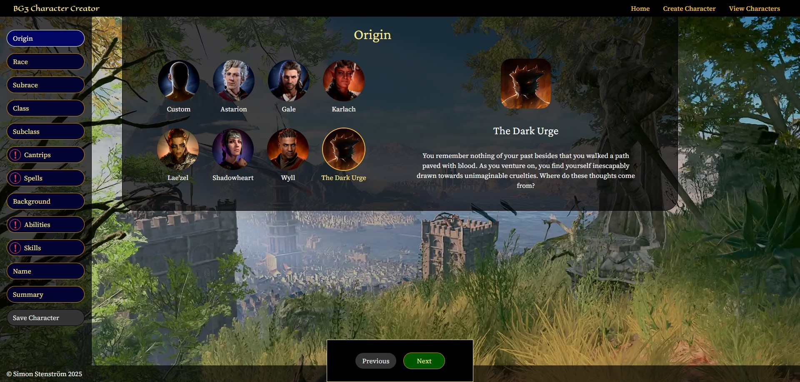
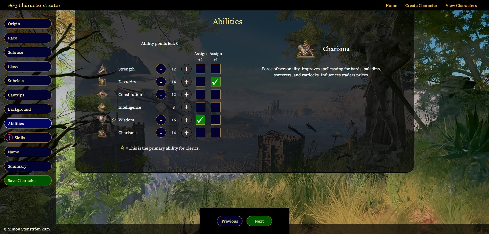
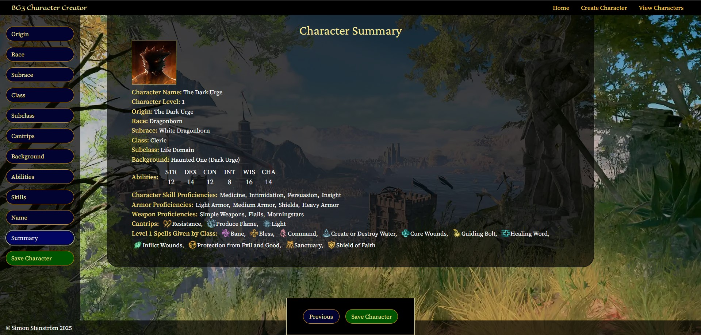

# Medieinstitutet Examination Project . BG3 Character Creator

A website that recreates how you create a level 1 character in the game Baldru's Gate 3. Made in slightly more than 4 weeks. Allows user to create a character and to view characters that they or other have created.

## Tech stack:

## Screenshots

#### Landing page:

#### View created characters page:

#### Creating character - origin:

#### Creating character - abilities:

#### Creating character - summary:

